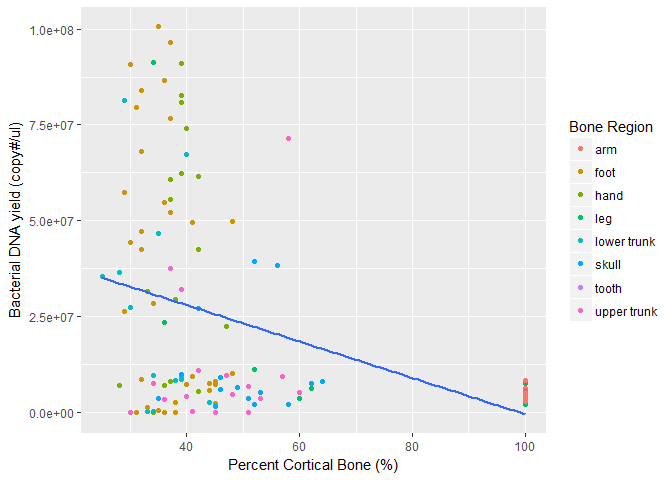

# Bacterial DNA versus cortical content from surface remains
Alex Emmons  
20 Feb 2017  


#Introduction: 
#The data used in the following code is metadata associated with microbial 16S rRNA and 18S rRNA sequence data taken from mutliple bone types across three human individuals that decomposed in a natural surface environment. The purpose of this script was to look at the relationship between bacterial DNA abundance data as a function of cortical bone content. 


#Results: 

```r
library(ggplot2)
metadataBone3 <- read.csv("C:/Users/Alexandra Emmons/Dropbox/BoneSurfaceProject/BoneSurface_metadata_all.csv")
graph2 <- ggplot(metadataBone3, aes(X..Cortical, Bacterial.DNA, colour=Body.region)) + 
  geom_point() +
  geom_smooth(method = "lm", se = FALSE, inherit.aes = FALSE, aes(X..Cortical, Bacterial.DNA))
graph2 + ylab("Bacterial DNA yield (copy#/ul)") + xlab("Percent Cortical Bone (%)")+ 
  scale_colour_discrete(name = "Bone Region")
```

```
## Warning: Removed 45 rows containing non-finite values (stat_smooth).
```

```
## Warning: Removed 45 rows containing missing values (geom_point).
```

<!-- -->
#Though bones with the highest cortical content corresponded with less bacterial infiltration, the overall relationship did not appear to be linear. 

#A linear model can be used to test the relationship between bacterial DNA and cortical bone content. 

```r
fit1 <- lm(Bacterial.DNA ~ X..Cortical, data = metadataBone3, na.action = na.exclude)
summary(fit1)
```

```
## 
## Call:
## lm(formula = Bacterial.DNA ~ X..Cortical, data = metadataBone3, 
##     na.action = na.exclude)
## 
## Residuals:
##       Min        1Q    Median        3Q       Max 
## -32678091 -20618401  -6908507  13517672  70282904 
## 
## Coefficients:
##             Estimate Std. Error t value Pr(>|t|)    
## (Intercept) 46973831    6045612   7.770 3.34e-12 ***
## X..Cortical  -475021     113432  -4.188 5.49e-05 ***
## ---
## Signif. codes:  0 '***' 0.001 '**' 0.01 '*' 0.05 '.' 0.1 ' ' 1
## 
## Residual standard error: 26960000 on 117 degrees of freedom
##   (45 observations deleted due to missingness)
## Multiple R-squared:  0.1304,	Adjusted R-squared:  0.1229 
## F-statistic: 17.54 on 1 and 117 DF,  p-value: 5.487e-05
```
#The linear relationship appears to be significant; however, the model is weak (r sqaured= 0.1229)

#Discussion:
#Bacteiral DNA infiltration is not necessarily controlled by cortical bone content; though, the two seem to be related. 


